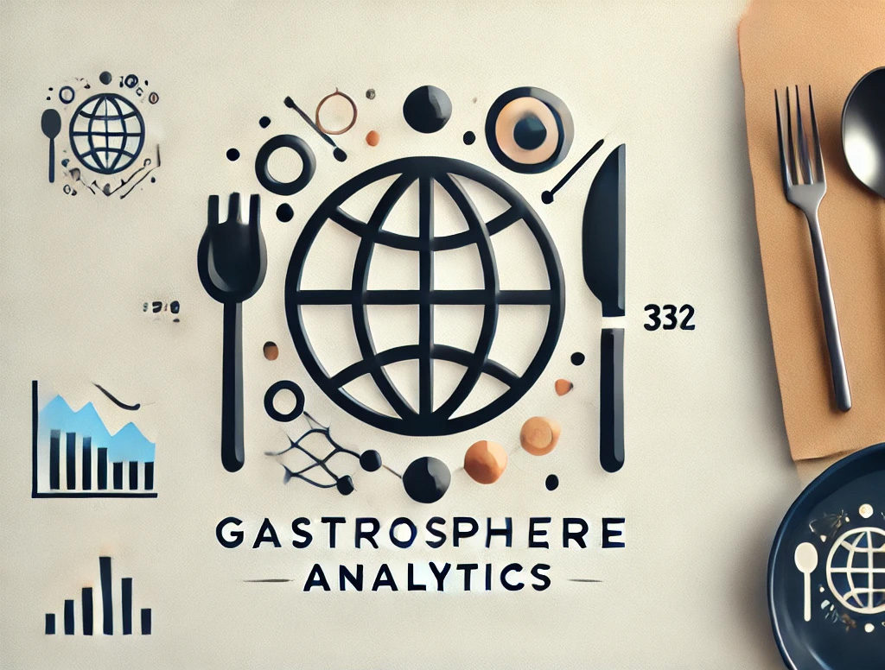
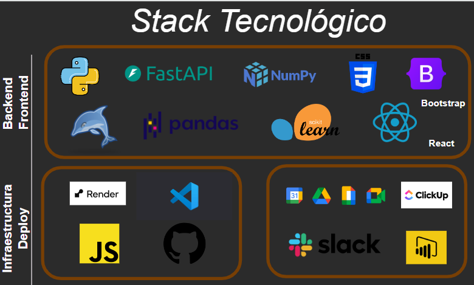
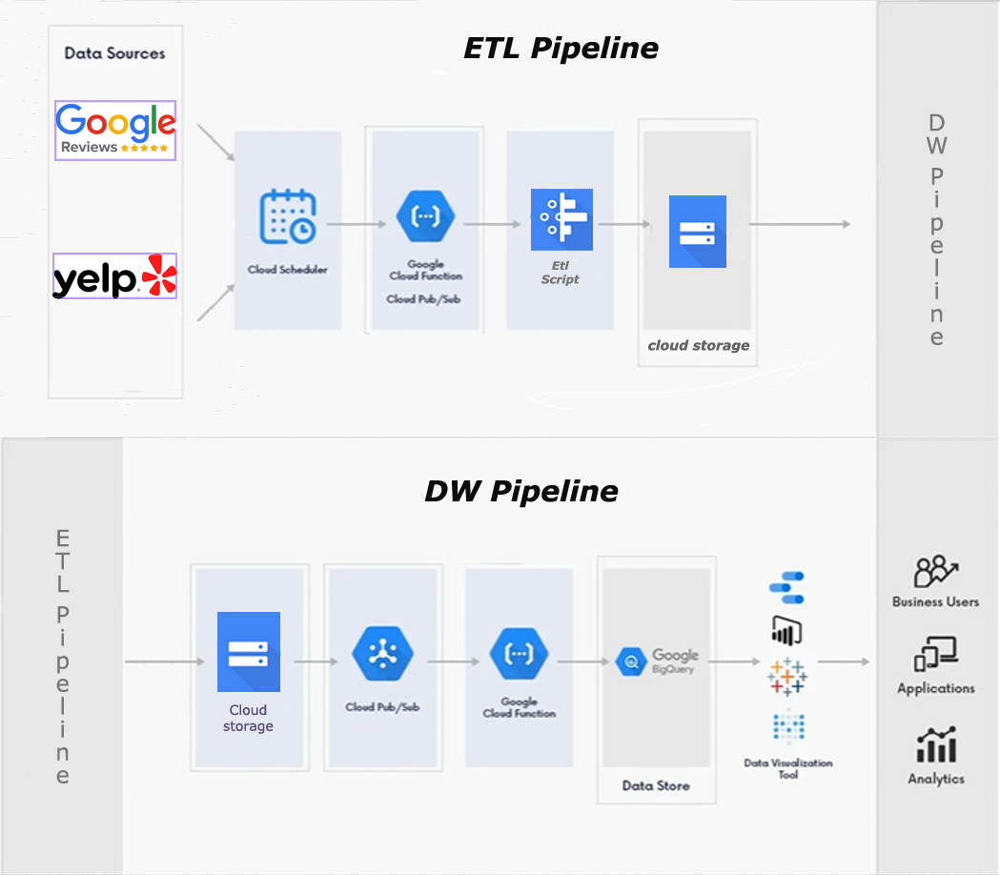
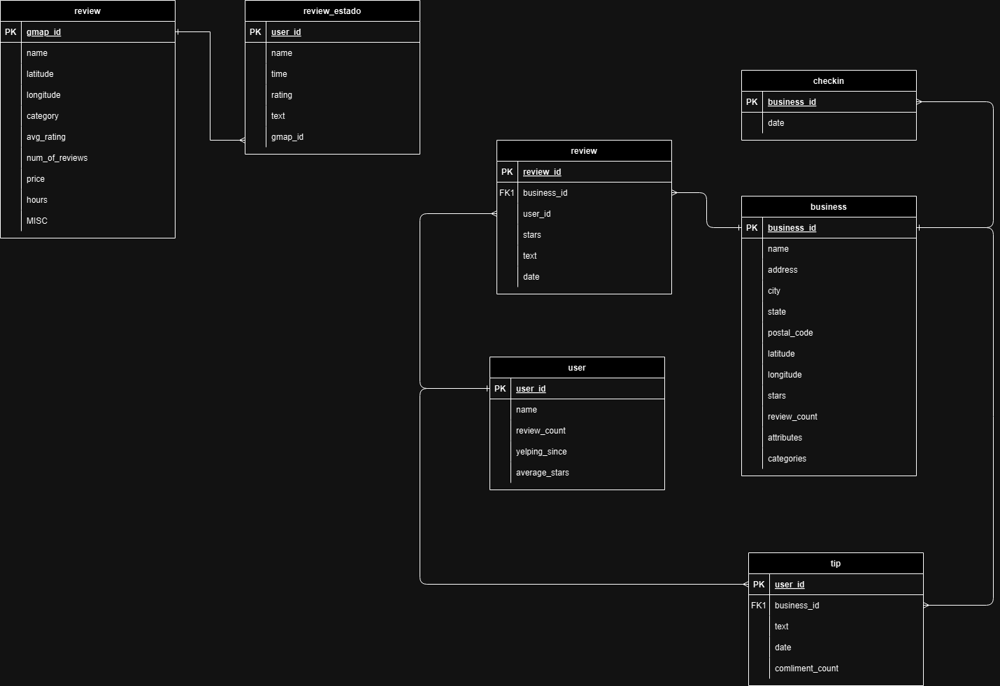
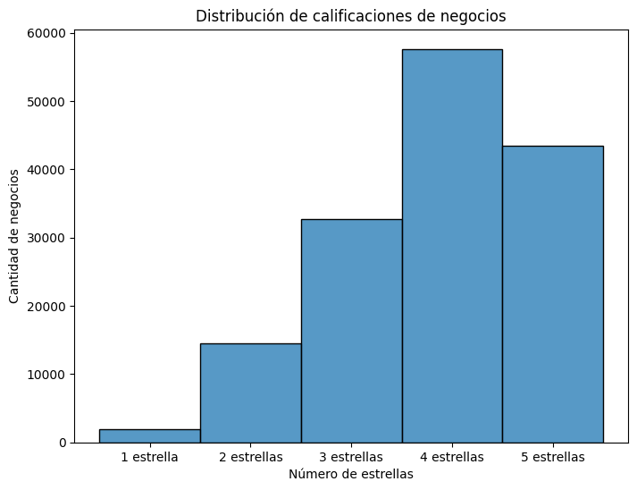
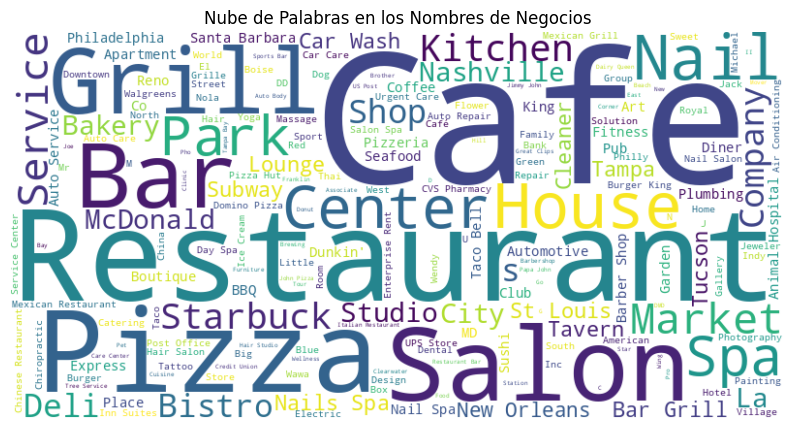
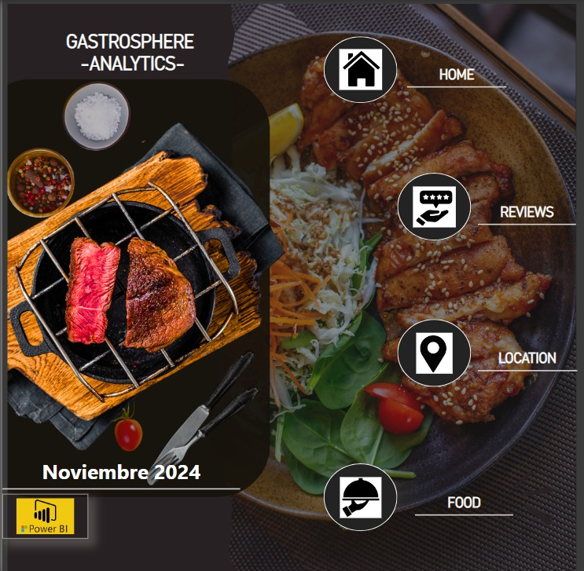
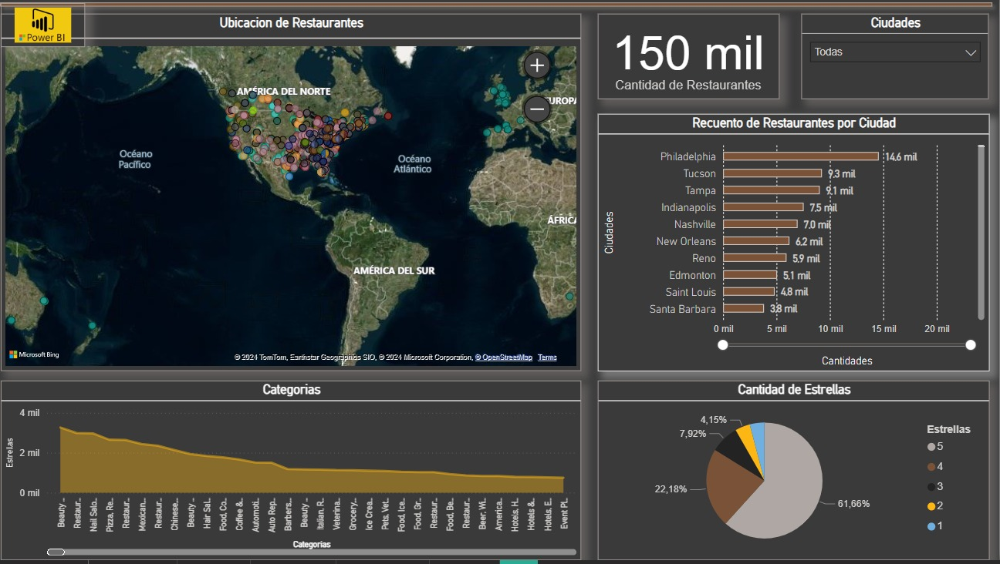

# <h1 align=center> **Proyecto Grupal - HENRY DATA ANALYST** </h1>

## <h1 align=center>**`Yelp - Google`**</h1>

  
<h2> Primer Sprint</h2> 

## 1.- Objetivos:  
● Análisis de Sentimientos:   
Aplicar técnicas de NLP (Natural Language Processing) para
clasificar reseñas de Yelp y Google Maps como positivas, negativas o neutras. Además nos enfocaremos en aspectos específicos como:  
● Comentarios relacionados con el servicio (amabilidad del personal, tiempo de
espera, atención al cliente).  
● Condiciones del ambiente (limpieza, ruido, confort).  
● Factores específicos de la cocina (calidad de la comida, temperatura, presentación).  
● Predicción de Tendencias del Mercado: Implementar modelos de machine learning para predecir tendencias en el mercado de restaurantes, basados en datos históricos y actuales,con el objetivo de identificar tipos de restaurantes con mayor probabilidad de crecimientoo declive.  
● Recomendación de Ubicaciones para Nuevos Restaurantes: Realizar un análisis
geo-espacial a fin de identificar regiones con alta concentración de restaurantes (conocidas como polos gastronómicos). Este análisis debe segmentar la información según la cantidad de estrellas y el tipo de restaurante, proporcionando una visión clara y estratégica para abrir nuevos restaurantes.  
● Sistema de Recomendación de Restaurantes: desarrollar un sistema de recomendación de restaurantes que provea a los usuarios sugerencias personalizadas basadas en sus preferencias individuales y experiencias previas. Este sistema utilizará técnicas avanzadas de machine learning y análisis de datos para ofrecer recomendaciones que no solo se
adapten a los gustos y hábitos de los usuarios, sino que también tengan en cuentavfactores contextuales, como la hora del día, la ubicación actual y las tendencias recientes en las reseñas.  
## 2.- Alcance del Proyecto
Análisis del Mercado y Recomendación de Restaurantes
1. Objetivos y Metas del Proyecto:  
● Análisis exhaustivo del mercado: Realizar un análisis detallado del mercado
estadounidense, enfocado en restaurantes, utilizando datos de Yelp y Google Maps.
● Modelo de Machine Learning: Implementar un modelo para el análisis de
sentimientos y predicción de tendencias del mercado de restaurantes.
● Sistema de Recomendación: Desarrollar un sistema de recomendación de
restaurantes personalizado a los usuarios finales.
2. Entregables:  
● DataWarehouse en Google Cloud:
- Configuración de Google Cloud para el almacenamiento y gestión de datos
de Yelp y Google Maps.
- Implementación de procesos ETL (Extracción, Transformación y Carga) para
la integración de datos.
- Realización de un Análisis Exploratorio de Datos (EDA) completo para
descubrir patrones y tendencias.
● .Análisis de Sentimientos:
Informes detallados que clasifiquen las reseñas como positivas, negativas o
neutras.
● Modelos Predictivos:
Predicciones sobre el crecimiento o declive de restaurantes basadas en
datos históricos y actuales.
● Sistema de Recomendación:
Prototipo funcional que ofrezca sugerencias personalizadas de restaurantes.
● Análisis Espacial:
Recomendaciones de ubicaciones óptimas para nuevos restaurantes,
basadas en un análisis espacial y demográfico.
● Dashboard Interactivo:
Visualización de los resultados del análisis de sentimientos, predicciones de
tendencias, recomendaciones de ubicaciones.
3. Tareas y Actividades:
● Recolección y Limpieza de Datos:
Obtención y limpieza de datos desde Google Maps y Yelp.
● Diseño y Desarrollo del DataWarehouse:
Diseño e implementación del DataWarehouse en Google Cloud.
● Implementación de Procesos ETL:
Desarrollo de pipelines para la extracción, transformación y carga de datos.
● Análisis Exploratorio de Datos (EDA):
Realización de EDA para analizar y comprender los datos.
● Desarrollo y Validación de Modelos de Machine Learning:
Entrenamiento y evaluación de modelos para análisis de sentimientos y
predicción de tendencias.
● Creación de Dashboards Interactivos en Power BI:
Desarrollo de dashboards para la visualización de datos y resultados.
● Implementación de la Metodología Scrum:
Gestión del proyecto utilizando la metodología Scrum con sprints y
reuniones diarias.
● Desarrollo de Pipelines de Datos:
Diseño y desarrollo de pipelines para la automatización de procesos de
datos.
● Documentación:
Elaboración de documentación técnica.
4. Exclusiones del Proyecto:
● No se realizará una implementación física de nuevos restaurantes.
● No se incluirán datos fuera del mercado estadounidense.
● No se cubrirán otros rubros de negocio distintos a los restaurantes.
Restricciones:
● Tiempo: El proyecto debe completarse en un plazo de 6 semanas.
● Presupuesto: Limitado a la infraestructura de Google Cloud y herramientas de desarrollo
(ClickUp, Python).
● Recursos: Equipo limitado con roles definidos (Scrum Master, Product Owner, Equipo de
Desarrollo).
## 3.- KPIs
● Aumentar en 5% la razón de reseñas positivas de un trimestre con respecto al anterior
para un restaurante particular. La razón de reseñas positivas se calcula como: reseñas
positivas (por trimestre) / total de reseñas (por trimestre).
● Aumentar trimestralmente en 1 (uno) la cantidad de categorías de reviews donde la
relación de las positivas sobre sea mayor a 1. Las categorías de reviews salen de la
clasificación del análisis de sentimientos y pueden ser positivas, negativas o neutrales.
● Bajar trimestralmente en 10% la calificación negativa (2 o menos estrellas).
## 4.- EDA
La realización de un ETL y EDA preliminar permiten tener un primer acercamiento a la
consistencia de los datos, identificar qué datos están disponibles y aumentar el entendimiento de
los mismos.
Para la Demo # 1 se realizaron ETL y EDA preliminares los que arrojaron las primeras
impresiones:
● Las reviews son en su mayoría positivas
● La mayoría de las calificaciones son de 3 o más estrellas, 2 estrellas es lo menos
frecuente.
● La categoría useful es la más frecuente a la hora de clasificar una review.
● Más del 50% de los usuarios hizo 6 o menos reviews.
● Los rubros más frecuentes son restaurant y food.
● La mayoría de los negocios cuenta con menos de 20 reviews, con la media en 10 reviews.
● Los restaurantes con calificaciones más bajas (alrededor de 1 y 2 ) tienden a tener muy
pocas reseñas.
## 5.- Metodología
Metodología de Trabajo: Scrum dentro del Marco Ágil
Enfoque Ágil
El proyecto se gestionará utilizando el marco Ágil (Agile), que permite un desarrollo flexible,
adaptable y basado en la retroalimentación continua. Este enfoque prioriza la entrega
incremental de valor al cliente y responde eficazmente a los cambios y necesidades del entorno.
Dentro de este marco, implementaremos Scrum, una metodología ágil ampliamente utilizada para
gestionar proyectos de software y desarrollo de productos. Scrum nos permitirá dividir el trabajo
en ciclos cortos, llamados sprints, facilitando la evaluación continua y la mejora del producto a
través de reuniones periódicas y retroalimentación constante.
Etapas de la Metodología Scrum
1. Product Backlog
Se recopilarán todas las historias de usuario, requisitos y tareas necesarias para el
desarrollo del proyecto. Estas historias representan las funcionalidades clave y se
priorizarán según su impacto en los objetivos del sistema de alertas y predicción.
2. Sprint Planning
Al inicio de cada sprint (2 semanas), se llevará a cabo una reunión de planificación del
sprint donde el equipo seleccionará las historias de usuario más relevantes del backlog.
Estas se dividirán en tareas más pequeñas y manejables, asegurando que el equipo tenga
una carga de trabajo realista y alcanzable.
3. Sprints
Durante cada sprint, el equipo trabajará en las tareas seleccionadas, siguiendo los
principios de desarrollo iterativo e incremental. El progreso se monitoreará mediante
ClickUp, permitiendo transparencia en el avance y las prioridades.
Para cada tarea decidimos entre el grupo desarrollador que haya un encargado que haga
la revisión técnica, divida tareas y también escriba código.
4. Daily Scrum (Reuniones Diarias)
Se realizarán reuniones cortas diarias (~60 minutos) para que cada miembro del equipo
reporte lo siguiente:
○ Qué se hizo el día anterior.
○ Qué se va a hacer hoy.
○ Si hay algún obstáculo o problema.
Van a ser 3 veces por semana (Lunes, Miércoles y Viernes) con el Scrum Master y Martes y
Jueves solo el grupo desarrollador e implementando mas si es necesario durante los fines
de semana
Esto fomenta la comunicación, identifica problemas rápidamente y asegura que todos
estén alineados con los objetivos del sprint.
5. Sprint Review (Demo)
Al final de cada sprint, se presentará el producto o incremento desarrollado a los
interesados clave. El objetivo es recibir retroalimentación directa para adaptar el desarrollo
a las expectativas del cliente y hacer ajustes para futuros sprints.
6. Sprint Retrospectiva
Después de la revisión del sprint, el equipo participará en una retrospectiva donde se
reflexionará sobre:
○ Qué se hizo bien.
○ Qué se puede mejorar.
○ Acciones para optimizar el proceso en el siguiente sprint.
Esto asegura una mejora continua no solo en el producto, sino también en la metodología
y colaboración del equipo.
Roles Clave en Scrum
1. Product Owner : Pia Ruiz Jaimes
Es el responsable de definir las prioridades del backlog, asegurando que el equipo trabaje
en las tareas más importantes para el cliente. Además, se encarga de asegurar que el
producto cumpla con los objetivos estratégicos.
2. Scrum Master : Alfredo Trujillo
El Scrum Master facilita el proceso de Scrum, eliminando impedimentos y ayudando al
equipo a seguir las prácticas de Scrum correctamente. También protege al equipo de
interrupciones externas y facilita la colaboración.
3. Development Team : Guillermo Veron, Joaquin Costamagna, Jose Cruz, Maria Jose
Atencio, Fernando Garcias Corts
Un equipo auto organizado de desarrolladores, analistas de datos y otros roles técnicos
que se encargan de llevar a cabo las tareas seleccionadas del sprint backlog. El equipo es
responsable de entregar incrementos de valor al final de cada sprint.
## 6.- Stack Tecnológico
#### Backend:  
● Lenguaje Principal: Python  
● Framework: FastAPI (TBD)  
● Base de Datos: PostgreSQL (TBD)  
● Algoritmos y Librerías de Recomendación:  
○ TextBlob: Para el análisis de sentimiento de las reviews  
○ Scikit-learn: Para el cálculo de la similitud de coseno.(TBD)  
○ HDBSCAN: Para la clusterización de restaurantes.  
○ Pandas: Para la manipulación de los datos.  
○ Numpy: Para las operaciones numéricas.  
● API REST: Endpoints creados con FastAPI para la comunicación entre el frontend y el backend. (TBD)  
#### Frontend:  
● Lenguaje Principal: Python  
● Framework: React (TBD)  
● Estilización: CSS/Bootstrap/Tailwind (TBD)  
Infraestructura y Deploy:  
● Proveedor de Hosting: Render (TBD)  
● Contenedores: Google Cloud  
● Control de Versiones: Git y GitHub (https://github.com/negoveron/PF_GY_DPT10)  
#### Análisis de Datos y Visualización:  
● Power BI: Utilizado para generar reportes interactivos y visualizaciones de los datos del sistema de recomendación.  
○ Visualizaciones: Se presentan gráficos que muestran las métricas de precisión ,como la cantidad de usuarios que coincidieron en gustos, la precisión de las recomendaciones, y las restaurants más recomendados.  
○ Conexión a Datos: Power BI se conectará a la base de datos Google Cloud para
extraer los datos necesarios y realizar el análisis visual.  
#### Herramientas Adicionales:  
● Editor de Código: Visual Studio Code  
● Herramientas de Colaboración:  
○ Clickup (https://app.clickup.com/9011445165/v/li/901105723447) / Slack / Google Meet  

  
<h2>Segundo Sprint</h2>

### ETL Completo

- [Carpeta Notebooks ETL](https://github.com/negoveron/PF_GY_DPT10/tree/0af87f6a9a777b1032d4f1f09d5176896dc36245/Demo_2/ETL2)

### Estructura de Datos Implementada (DW)
## Ciclo de vida del dato 

El ciclo de vida de nuestros datos comienza con la recolección de información desde diversas fuentes externas, incluyendo bases de datos relacionales, archivos de tipo JSON y Parquets de terceros. Estas fuentes externas contienen datos en múltiples formatos y estructuras, lo que presenta el primer desafío: asegurar que la información pueda ser unificada y estandarizada para su procesamiento y análisis.

En la siguiente etapa, los datos pasan a través de un pipeline ETL (Extracción, Transformación y Carga). En la fase de extracción, los datos son capturados desde sus fuentes originales y transferidos al entorno de procesamiento para realizar una `validacion de datos` para realizar un primer tratamiento. Luego, en la transformación, aplicamos reglas y procedimientos para limpiar, estandarizar y enriquecer los datos, eliminando duplicados, gestionando valores nulos y asegurando que cumplan con los requisitos de calidad y estructura para su uso posterior. Finalmente, en la fase de carga, los datos transformados son transferidos a un entorno intermedio o directamente al almacén de datos (Data Warehouse) para su almacenamiento y análisis.

Una vez que los datos han pasado por el pipeline ETL y se encuentran en un formato consistente, ingresan a un Data Warehouse a través de un segundo pipeline diseñado para gestionar su integración en un almacén de datos centralizado. Este Data Warehouse organiza los datos en estructuras optimizadas para la consulta, facilitando el acceso y la recuperación rápida de información para análisis profundos y generación de reportes. Este almacenamiento permite gestionar grandes volúmenes de datos históricos, ofreciendo una visión completa de la información consolidada de la organización.

Finalmente, los datos almacenados en el Data Warehouse están listos para ser consumidos por herramientas de análisis como ser Power BI. En esta última etapa, Power BI permite a los usuarios crear reportes interactivos y dashboards visuales que facilitan la exploración y análisis de la información. Los reportes generados en Power BI proporcionan métricas y tendencias clave, posibilitando una toma de decisiones informada y estratégica. A través de estos dashboards, los usuarios pueden acceder a una representación visual de los datos, realizar análisis en tiempo real y compartir insights de manera ágil y eficiente.

Este proceso detallado compuesto por ambos pipelines conforman la `automatizacion` del ciclo de vida de los datos, que va desde la extracción y transformación inicial hasta su análisis y visualización final, asegura que los datos estén alineados con las necesidades analíticas de la organización y facilita la toma de decisiones fundamentadas en información confiable y actualizada.

### 1 _ Pipeline ETL Automatizado:

Se ha desarrollado un pipeline de datos, un proceso estructurado que nos permitió automatizar la captura, transformación y carga de información de diferentes fuentes hacia un entorno de análisis. Este pipeline cumple un rol clave en la gestión de datos moderna, ya que asegura la integración y disponibilidad de datos actualizados y fiables para la toma de decisiones y análisis de negocio.

#### Objetivos
- El principal objetivo del pipeline de datos es procesar información de manera eficiente, de tal forma que pueda ser transformada y cargada en un repositorio para su análisis. Algunos objetivos específicos incluyen:

- - Automatizar la extracción de datos desde fuentes heterogéneas.
Estandarizar y limpiar los datos para su análisis.
Coordinar las tareas de manera secuencial y con manejo de errores.
Generar un flujo de datos confiable y escalable.
Metodología y Etapas del Pipeline
Para lograr estos objetivos, dividimos el pipeline en las siguientes etapas:

- Extracción de Datos: La primera etapa consiste en la extracción de datos desde fuentes de origen, que pueden incluir bases de datos relacionales, archivos JSON o APIs de terceros. Para asegurar la conectividad y disponibilidad de datos, empleamos herramientas de integración y realizamos un monitoreo continuo de las fuentes de datos.

- Transformación de Datos: En esta fase, se realizan las transformaciones necesarias para asegurar la calidad y estandarización de los datos. Esto incluye tareas de limpieza, normalización y eliminación de duplicados, así como también cualquier preprocesamiento específico para adaptar los datos a los requisitos del análisis. Utilizamos herramientas como pandas para manejar grandes volúmenes de datos de forma eficiente.

- Carga de Datos: Una vez que los datos han sido procesados y se encuentran en un formato adecuado, los cargamos en el datawarehouse de GoogleCloud donde se correra un pipelineDW para luego cargarlo a BigQuery

- Orquestación y Automatización: Para gestionar la secuencia de las tareas y sus dependencias, hemos utilizado un orquestador de datos. Este orquestador nos permitió automatizar y programar la ejecución del pipeline, monitorear el estado de cada etapa y asegurar que los errores sean manejados adecuadamente. Para esto, hemos utilizado AirFlow de la suite de GoogleCLoud, que facilita la programación y ejecución de flujos de trabajo complejos.

- Monitoreo y Gestión de Errores: La última etapa en el pipeline implica un monitoreo activo de las tareas en ejecución y el manejo de errores en tiempo real. Implementamos registros de logs y alertas para asegurar la detección temprana de fallos, de manera que las tareas puedan ser reintentadas automáticamente o escaladas para su resolución.

#### Resultados
El pipeline desarrollado logró reducir el tiempo manual de procesamiento de datos y mejorar la calidad de la información analizada. Gracias a la automatización de las tareas de extracción, transformación y carga, el equipo de análisis ahora puede acceder a datos consistentes y en tiempo real. Esto ha permitido un análisis más ágil y ha facilitado la toma de decisiones basada en datos actualizados.

#### Desafíos y Soluciones
Durante el desarrollo del pipeline, enfrentamos varios desafíos, tales como:

- - Integración de fuentes heterogéneas: Resolver incompatibilidades entre los distintos formatos de datos y asegurar la conectividad constante.
Escalabilidad: Optimizar el rendimiento del pipeline para manejar volúmenes crecientes de datos sin afectar la velocidad o calidad de los procesos.
- - Manejo de Errores: Implementar un sistema robusto de gestión de errores para asegurar que el pipeline pueda recuperarse de fallos y continuar con la ejecución del flujo de datos.
- - Para resolver estos desafíos, implementamos una estrategia de reintentos automáticos, procesamiento en paralelo para ciertas tareas, y monitoreo continuo del estado del pipeline.

#### Conclusión:  
El desarrollo de este pipeline de datos representa una solución integral para gestionar, transformar y analizar datos de manera eficiente. Esta implementación de automatización y orquestación de datos permite a la organización beneficiarse de un flujo de trabajo de datos confiable, escalable y alineado con las necesidades de análisis. A futuro, planeamos mejorar el pipeline mediante la incorporación de capacidades de escalabilidad en la nube y de machine learning para optimizar aún más el procesamiento de los datos y generar información de valor en tiempo real.

### 2_ Pipeline para alimentar el DW

Este pipeline, implementado como una función en **Cloud Run**, está diseñado para automatizar la carga de datos de reseñas provenientes de archivos CSV en Google Cloud Storage hacia BigQuery. La función `function-carga-wh` valida los archivos entrantes, extrae los datos, los transforma y los carga en BigQuery para su posterior análisis. Este proceso permite manejar eficientemente los datos de reseñas de Yelp y Google Maps, haciendo posible el análisis de la opinión de los usuarios y facilitando la creación de modelos de machine learning para recomendaciones y predicciones de mercado.

#### Componentes principales

##### Funciones y archivos
- **validate_data**: Valida que el archivo contenga las columnas requeridas.
- **load_to_bigquery**: Carga los datos en BigQuery, añadiéndolos a la tabla de destino especificada en las variables de entorno.
- **read_csv**: Lee el archivo CSV desde Google Cloud Storage.
- **name_validation**: Valida el nombre y el tipo de archivo.
- **gcs_to_bigquery**: Función principal que orquesta el flujo de trabajo.

#### Arquitectura del pipeline

1. **Disparador de Eventarc**: Configurado para escuchar eventos de finalización (`google.cloud.storage.object.v1.finalized`) en el bucket `test-pfgydpt10-bucket` de Google Cloud Storage. Cuando se sube un nuevo archivo CSV, se activa la función `function-carga-wh`.
2. **Validación del archivo**: La función `name_validation` verifica que el archivo tenga el prefijo `tip` y sea de tipo `csv` antes de continuar con el procesamiento.
3. **Lectura y validación de datos**: Si la validación es exitosa, `read_csv` lee el archivo y `validate_data` revisa que contenga las columnas necesarias (`user_id`, `business_id`, `text`, `date`).
4. **Carga a BigQuery**: Una vez validado, el archivo se carga en BigQuery utilizando `load_to_bigquery`. Si el proceso falla, el error se registra en Cloud Logging.
5. **Logging**: La función utiliza Cloud Logging para registrar errores y mensajes de seguimiento, permitiendo identificar problemas en el pipeline.

#### Variables de entorno

Estas variables son necesarias para configurar el entorno y deben ser configuradas en Cloud Run:

- `BQ_PROJECT_ID`: ID del proyecto de BigQuery.
- `BQ_DATASET_ID`: ID del dataset de BigQuery donde se cargan los datos.
- `BQ_TABLE_ID`: ID de la tabla de BigQuery.
- `LOG_EXECUTION_ID`: Flag opcional para habilitar o deshabilitar el logeo de ejecución.

### 3_ Data Warehouse

Se ha decidido por la opción de una estructura de DataWarehouse por las siguientes razones:

1. **Estructura de los Datos**:

   - Los datos que se manejan son estructuradosy organizados en tablas que han pasado por un proceso de limpieza y transformación (ETL). Esto permite optimizar el acceso a los datos y realizar consultas rápidas y complejas.
2. **Propósito de los Datos**:

   - Una de las principales propósitos es el análisis de datos históricos, con la posibilidad de una carga incremental. Estos datos estan bien definidos y depurados lo cual los hace mas compatible con un Data Warehouse
3. **Velocidad de Consulta y Rendimiento**:

   - Los *data warehouses* están diseñados para optimizar consultas rápidas en datos estructurados. Pueden entregar resultados de consultas en cuestión de segundos o minutos, ideal para aplicaciones de business intelligence.
4. **Costos y Mantenimiento**:

   - Los *data warehouses*, al implicar procesos de transformación de datos y optimización para consultas, pueden tener costos de almacenamiento y procesamiento superiores. Sin embargo, estos costos se justifican en entornos donde la rapidez y precisión en las consultas es fundamental para la toma de decisiones.

Finalemente ponderando la facilidad de uso, la capcidad de análisis rápidos y confiables de grandes cantidades de datos estructurados, a un costo inicial de $0 se optó por usar Cloud Storage Platform.

### Diseño ER

### Documentacion

- [Diccionario de datos](https://docs.google.com/document/d/1ASLMGAgrviicATaP1UJlflpmBCXtuSTHQGWdQMN6_2I/edit)

### Analisis de datos de muestra

El análisis exploratorio de datos (EDA) realizado sobre una muestra del conjunto de datos de negocios de Yelp y Google Maps se enfoca en identificar patrones y tendencias relacionadas con la ubicación, estado, y calificación de negocios en el mercado estadounidense. Este análisis proporciona una visión preliminar del estado de los negocios, sus calificaciones promedio y su distribución geográfica, lo que puede ser útil para estrategias de marketing, optimización de localización y evaluación de la satisfacción del cliente. Dicho EDA se enfocó en: 

1. **Estado de Apertura de los Negocios**:
   La mayoría de los negocios en el dataset están activos. Un análisis detallado muestra que alrededor de un 80% de los negocios están abiertos, mientras que aproximadamente el 20% están cerrados. Esta proporción puede ser útil para evaluar la estabilidad de negocios en distintas ubicaciones.

2. **Distribución de Negocios por Estado**:
   Los estados de Pensilvania (PA) y Florida (FL) cuentan con la mayor cantidad de negocios en el dataset, seguidos de Tennessee (TN), Indiana (IN), y Misuri (MO). La alta densidad en ciertos estados puede reflejar una mayor competencia y saturación en estos mercados, lo cual es relevante para futuras estrategias de expansión.

3. **Distribución de Calificaciones**:
   Las calificaciones de los negocios muestran una tendencia positiva, con la mayoría de los negocios ubicados entre 3 y 5 estrellas. La categoría más frecuente es la de 4 estrellas, lo que sugiere que, en general, los clientes están satisfechos con la calidad de los servicios. Las calificaciones más bajas son menos comunes, lo que indica un sesgo hacia valoraciones positivas.

  

  

5. **Análisis de Reseñas por Calificación**:
   Los negocios con calificaciones altas (4 y 5 estrellas) tienden a tener una mayor cantidad de reseñas, indicando una correlación entre la popularidad de los negocios y su calificación. Este hallazgo es valioso para identificar negocios destacados que atraen mayor atención y fidelización de clientes.

6. **Análisis de Ciudades**:
   Filadelfia, Tucson, y Tampa lideran en cantidad de negocios dentro del dataset. Esta concentración puede ser indicativa de áreas con una alta actividad comercial, especialmente en sectores de turismo y restauración. También se identificaron más de 1,400 ciudades únicas, lo que muestra una buena representatividad geográfica en los datos.

7. **Matriz de Correlación**:
   La matriz de correlación entre variables numéricas como `latitude`, `longitude`, `stars`, `review_count`, y `is_open` muestra correlaciones bajas, indicando que las variables son en su mayoría independientes entre sí. Este análisis sugiere que no existen relaciones lineales fuertes, lo cual orienta la necesidad de métodos avanzados para un análisis más profundo.

8. **Nube de Palabras en Nombres de Negocios**:
   La nube de palabras generada muestra que términos como "Cafe," "Restaurant," "Bar," "Pizza," y "Grill" son los más frecuentes en los nombres de negocios, destacando la prevalencia de la industria de alimentos y bebidas en el dataset.

  

  

- [Link al EDA](https://github.com/negoveron/PF_GY_DPT10/blob/main/EDA/EDA.ipynb)

### MVP/Proof of concept de producto ML

 

   

- [Link al Dashboard](https://docs.google.com/document/d/1ASLMGAgrviicATaP1UJlflpmBCXtuSTHQGWdQMN6_2I/edit)

  

  
<h2> Tercer Sprint </h2>

  Coming soon..

## Autores! 👋

|   <h3 align=center>Foto</h3> |  |
|--------|-------------|
|  | [Linkedin José](https://www.linkedin.com/in/jose-yesid-cruz-pinto/) |
|  | [Linkedin Joaquin](https://www.linkedin.com/in/joaquin-costamagna-028654215/) |
|  | [Linkedin Maria Jose](https://www.linkedin.com/in/maria-jose-atencio-96a8761aa/) |
|  | [Linkedin Fernando](https://www.linkedin.com/in/fernando-garcias-corts-326a4027) |
|  | [Linkedin Guillermo](https://www.linkedin.com/in/guillermo-andres-veron/) |

